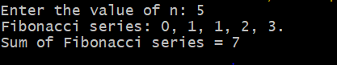

#Additional2
# TITLE: Additional-2.) Implement the sum of the n fibonacci numbers
```
import java.util.Scanner;
class Fibonacci {
int sum;
int n;
int firstNumber;
int secondNumber;
int thirdNumber;
Fibonacci(int number) {
n = number;
firstNumber = 0;
secondNumber = 1;
thirdNumber = 0;
sum = 0;
}
void generate() {
if(n>0)
System.out.print("Fibonacci series: ");
while (n > 0) {
if (n == 1) {
System.out.println(firstNumber + ".");
sum = sum + firstNumber;
} else {
System.out.print(firstNumber + ", ");
sum = sum + firstNumber;
}
thirdNumber = firstNumber + secondNumber;
firstNumber = secondNumber;
secondNumber = thirdNumber;
n--;
}
System.out.println("Sum of Fibonacci series = " + sum);
}
public static void main(String[] args) {
Scanner sc = new Scanner(System.in);
System.out.print("Enter the value of n: ");
int number = sc.nextInt();
Fibonacci f = new Fibonacci(number);
f.generate();
}
}
```
# output

