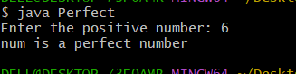

# Additional-3
# TITLE: Additional-3. ) Java program to check if a number is a perfect number
```
import java.util.Scanner;

class Perfect {

    public static void main(String args[]) {

        Scanner sc = new Scanner(System.in);

        System.out.print("Enter the positive number: ");
        int num = sc.nextInt();

        int sum = 0;

        for (int i = 1; i < num; i++) {

            if (num % i == 0) {
                sum = sum + i;
            }
        }

        if (sum == num) {
            System.out.println("num is a perfect number");
        }
        else {
            System.out.println("num is not a perfect number");
        }
    }
}
```
# output

