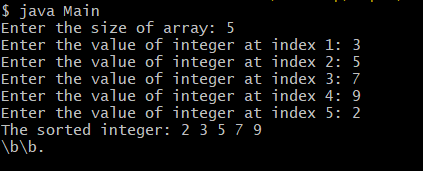

# TITLE: 3c.) Sorting Element using Bubble Sort
```
 class BubbleSort {

	void bubbleSort(int arr[]) {

		int n = arr.length;
		int temp = 0;

		for(int i=0 ; i < n-1 ; i++) {

			for(int j=0; j<n-i-1; j++) {

				if(arr[j] > arr[j+1]) {

					temp = arr[j+1];
					arr[j+1] = arr[j];
					arr[j] = temp;

				}
			}
		}

	}

}
```
Main.java
import java.util.Scanner;
 class Main {
	
	public static void main(String args[]) {


		System.out.print("Enter the size of array: ");
		Scanner sc = new Scanner(System.in);
		int size = sc.nextInt();

		int integer[] = new int[size];

		for(int i = 0; i < size; i++) {

			System.out.print("Enter the value of integer at index " + (i+1) + ":"); 
			integer[i] = sc.nextInt();
		}

		BubbleSort bs = new BubbleSort();
		bs.bubbleSort(integer);


		System.out.print("The Sorted integer: ");

		for(int i = 0; i < size; i++)
		System.out.print(integer[i] + ", ");

		System.out.println("\b\b.");

	}

}
# output

