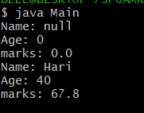

# TITLE 3a.) Implement constructor overloading in JAVA
```
class Student {

	String name;
	int age;
	double marks;

	Student() {

	}

	Student(String name, int age, double marks) {

		this.name=name;
		this.age=age;
		this.marks=marks;

	}

	void display() {

		System.out.println("Name: "+name);
		System.out.println("Age: "+age);
		System.out.println("marks: "+marks);

	}

}


Main.java

 class Main {

	public static void main(String args[]) {

		Student std = new Student();
		std.display();

		Student std1 = new Student("Hari", 40, 67.8);
		std1.display();

	}
}
```

