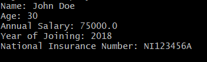
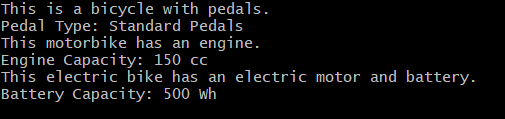
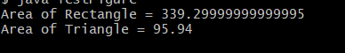

# Experiment 4
# TITLE: 4a.) Write a java program to implement single inheritance
```
class Person {

    String name;
    int age;

    Person(String name, int age) {
        this.name = name;
        this.age = age;
    }

    void displayPersonDetails() {
        System.out.println("Name: " + name);
        System.out.println("Age: " + age);
    }
}
class Employee extends Person {

    double annualSalary;
    int yearOfJoining;
    String nationalInsuranceNumber;

    Employee(String name, int age, double annualSalary, int yearOfJoining,
             String nationalInsuranceNumber) {

        super(name, age);
        this.annualSalary = annualSalary;
        this.yearOfJoining = yearOfJoining;
        this.nationalInsuranceNumber = nationalInsuranceNumber;
    }

    void displayEmployeeDetails() {

        displayPersonDetails();

        System.out.println("Annual Salary: " + annualSalary);
        System.out.println("Year of Joining: " + yearOfJoining);
        System.out.println("National Insurance Number: " + nationalInsuranceNumber);
    }
}
public class TestEmployee {

    public static void main(String[] args) {
        Employee emp = new Employee("John Doe",30,75000.0,2018,"NI123456A");
        emp.displayEmployeeDetails();
    }
}
```
# output


# Experiment 4
# TITLE: 4b.) write a java program to implement multi-level inheritance
```
class Bicycle {

    String pedalType;

    void showBicycleInfo() {
        System.out.println("This is a bicycle with pedals.");
        System.out.println("Pedal Type: " + pedalType);
    }
}
class Motorbike extends Bicycle {

    int engineCapacity;

    void showMotorbikeInfo() {
        System.out.println("This motorbike has an engine.");
        System.out.println("Engine Capacity: " + engineCapacity + " cc");
    }
}
class ElectricBike extends Motorbike {

    int batteryCapacity;

    void showElectricBikeInfo() {
        System.out.println("This electric bike has an electric motor and battery.");
        System.out.println("Battery Capacity: " + batteryCapacity + " Wh");
    }
}
class TestVehicle {

    public static void main(String[] args) {

        ElectricBike eBike = new ElectricBike();

        eBike.pedalType = "Standard Pedals";
        eBike.engineCapacity = 150;
        eBike.batteryCapacity = 500;

        eBike.showBicycleInfo();
        eBike.showMotorbikeInfo();
        eBike.showElectricBikeInfo();
    }
}
```
# output


# Experiment 4
# TITLE: 4c.) write a java program to construct abstract class to find areas of different shapes
```
abstract class Figure {

    double dim1;
    double dim2;

    Figure(double dim1, double dim2) {
        this.dim1 = dim1;
        this.dim2 = dim2;
    }

    abstract double area();
}
class Rectangle extends Figure {

    Rectangle(double length, double breadth) {
        super(length, breadth);
    }

    double area() {
        double result = dim1 * dim2;
        return result;
    }
}
lass Triangle extends Figure {

    Triangle(double base, double height) {
        super(base, height);
    }

    double area() {
        double result = 0.5 * dim1 * dim2;
        return result;
    }
}
class TestFigure {

    public static void main(String[] args) {

        Figure f1 = new Rectangle(23.4, 14.5);
        Figure f2 = new Triangle(12.3, 15.6);

        System.out.println("Area of Rectangle = " + f1.area());
        System.out.println("Area of Triangle = " + f2.area());
    }
}
```
# output

