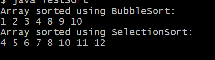
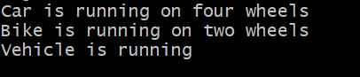
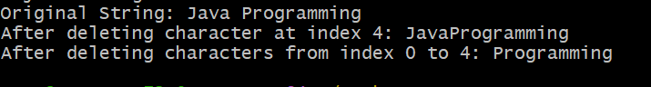

# EXPERIMENT 5
# TITLE: 5a.) A java program to implement interface
```
interface Sortable {
    void sort(int[] arr);
}

class BubbleSort implements Sortable {
    public void sort(int[] arr) {
        int n = arr.length;
        for (int i = 0; i < n - 1; i++) {
            for (int j = 0; j < n - i - 1; j++) {
                if (arr[j] > arr[j + 1]) {
                    // swap
                    int temp = arr[j];
                    arr[j] = arr[j + 1];
                    arr[j + 1] = temp;
                }
            }
        }
    }
}

class SelectionSort implements Sortable {
    public void sort(int[] arr) {
        int n = arr.length;
        for (int i = 0; i < n - 1; i++) {
            int minIndex = i;
            for (int j = i + 1; j < n; j++) {
                if (arr[j] < arr[minIndex]) {
                    minIndex = j;
                }
            }
            int temp = arr[i];
            arr[i] = arr[minIndex];
            arr[minIndex] = temp;
        }
    }
}

public class TestSort {
    static void printArray(int[] arr) {
        for (int num : arr) {
            System.out.print(num + " ");
        }
        System.out.println();
    }

    public static void main(String[] args) {
        int[] arr1 = {5, 2, 9, 1, 6};
        Sortable ref;

        ref = new BubbleSort();
        ref.sort(arr1);
        System.out.println("Array sorted using BubbleSort:");
        printArray(arr1);
        int[] arr2 = {8, 3, 7, 4, 2};
        ref = new SelectionSort();
        ref.sort(arr2);
        System.out.println("Array sorted using SelectionSort:");
        printArray(arr2);
    }
}
```
# output


# Experiment 4
# TITLE: 5b) Implementing Runtime Polymorphism
```
class Vehicle {
    void run() {
        System.out.println("Vehicle is running");
    }
}

class Car extends Vehicle {
    // Overriding method
    void run() {
        System.out.println("Car is running on four wheels");
    }
}

class Bike extends Vehicle {
    void run() {
        System.out.println("Bike is running on two wheels");
    }
}

public class TestVehicle {
    public static void main(String[] args) {
        Vehicle v;

        v = new Car();
        v.run(); 

        v = new Bike();
        v.run();

        v = new Vehicle();
        v.run();
    }
}
```
# output


# Experiment 5
# TITLE: 5c.) Delete character using String Buffer
```
public class StringBufferDeleteDemo {
    public static void main(String[] args) {

        StringBuffer sb = new StringBuffer("Java Programming");
        System.out.println("Original String: " + sb);

        sb.deleteCharAt(4);
        System.out.println("After deleting character at index 4: " + sb);

        sb.delete(0, 4);
        System.out.println("After deleting characters from index 0 to 4: " + sb);
    }
}
```
# output

