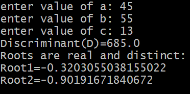

> ## experiment1
> ## TITLE: 1a.) Display the primitive datatypes
```
class Datatypes {
static byte b;
static short s;
static float f;
static char c;
static int i;
static double d;
static boolean bool;
public static void main(String[]args){
System.out.println("default primitive Datatypes");
System.out.println("byte="+b);
System.out.println("short="+s);
System.out.println("char="+c);
System.out.println("float="+f);
System.out.println("double="+d);
System.out.println("int="+i);
System.out.println("boolean="+bool); 
}
}
```
> # output


> ## TITLE: 1b.) Display the quadratic roots
```
import java.util.Scanner;
class QuadraticRoots{
public static void main(String[] args) {
Scanner sc = new Scanner(System.in);
Double a,b,c,D;
System.out.print("enter value of a: ");
a=sc.nextDouble();
System.out.print("enter value of b: ");
b=sc.nextDouble();
System.out.print("enter value of c: ");
c=sc.nextDouble();
D=b*b-4*a*c;
System.out.println("Discriminant(D)="+D);
if (D>0) {
Double x1=(-b+Math.sqrt(D))/(2*a);
Double x2=(-b-Math.sqrt(D))/(2*a);
System.out.println("Roots are real and distinct:");
System.out.println("Root1="+x1);
System.out.println("Root2="+x2);
} else if (D==0) {
Double x=-b*2/a;
System.out.println("Root="+x);
} else {
Double real=(-b/2*a);
Double imaginary=(Math.sqrt(-D)/(2*a));
System.out.println("Root1"+real+"+i"+imaginary);
System.out.println("Root2"+real+"-i"+imaginary);
} sc.close();
}
}
```
> ## output

